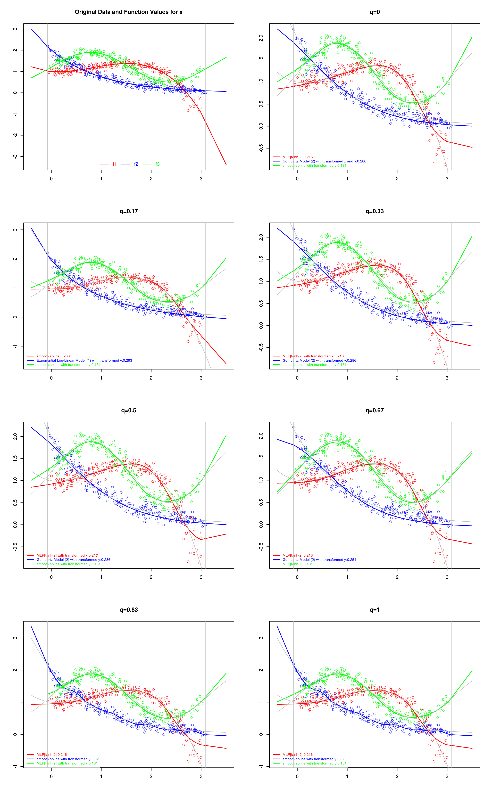

# An R Package for Fitting Models to 2-Dimensional (x-y) Data

## 1. Introduction

In many scenarios, we have two-dimensional data in the form of `(x, y)` tuples.
We then want to know the relationship between the `x` and the `y` coordinates.
The resulting model could be any type of function `f`.
In the ideal case, `f(x)=y` will hold, but of course if the data results from measurements, there may be some errors and deviations in it.
The goal is then to find the function `f` for which these deviations are as small as possible.

However, this goal could be misleading:
If we have `n` points, we can always use a polynomial of degree `n-1` to go exactly through all points: a constant for one point, a linear function through two points, a quadratic function through three points, a cubic polynomial through four points, etc.
Such a model would not necessarily make much sense.
Actually, such a model would not give us any new information since it basically just "encodes" the `(x, y)`
tuples, similar to a mathematical version of a lookup table.
This is called [overfitting](http://en.wikipedia.org/wiki/Overfitting), because this model fits well to the data that we know but won't fit to data that we will measure in the future from the same source.
What we want are thus models that *a)* fit well to the observed data but *b)* are not overfitted,
i.e., are likely to generalize and to fit to future observations. Ideally, of course, *c)* the
models should have few parameters and be compact.

Here, we try to make a package for getting such models automatically.
Our package uses a library of functional models which it applies to the measured data.
Additionally, it can also fit multi-layer perceptrons (by treating them as simple functions, same as the other models) and splines.
The fitting of the functional models is done using other `R` package, e.g., via the [Levenberg-Marquardt Algorithm](http://en.wikipedia.org/wiki/Levenberg%E2%80%93Marquardt_algorithm) and numerical optimization methods.
The package uses cross-validation to pick a model which seems to generalize well and then trains it again on the complete data set.
Our library furthermore attempts to deal with the fact that sometimes, models will not fit well on the raw data but on a log-scaled version of the data.
It does so by creating multiple different representations of the data and include these representations and the models in the learning step.
If two models seemingly fit similarly well to the data, then the smaller one will be selected.

All of this comes at the cost of higher runtime.
Hence, we provide a parameter `q` that can be used to tune the fitting effort from `0` (low) to `1` (maximum).
Our package is still in a very early version, it is not efficient, it is slow.
But it already somewhat works.

## 2. Examples

### 2.1. Motivating Example

Let's say we have some data `dx` and `dy` of more or less unknown nature and want to find
a function `f` which can properly represent the relationships between `dx` and `dy`.
The easiest way to do this with our package is simply invoking `regressoR.learn(x=dx, y=dy)`.
This will apply the complete palette of solvers and models to the data, internally perform cross-validation to fit the best fitting model, fit this model again on the complete data, and return it.

    dx <- rnorm(100);
    dy <- rnorm(n=100, mean=50*dx*dx-33);
    plot(dx, dy)
    result <- regressoR.learn(x=dx, y=dy);
    result@f
    # function (x)
    # -32.5442186855071 + (x * (0.776119279549966 + (x * 49.7907873618706)))
    result@quality
    # [1] 0.2455075
    dx.sorted <- sort(dx)
    lines(dx.sorted, result@f(dx.sorted), col="red")

Of course, the approach is limited to the functions currently in the model library.
But it also automatically tries to apply the models to transformed versions of the data, such as log-scaled variant.
This way, even with just a linear and a quadratic model in the library, we can represent exponential relationships:
    
    dx <- runif(100) + 0.1
    dy.raw <- 1 + 0.4* exp(5 - 3*dx + 0.6*dx*dx)
    dy <- rnorm(n=100, mean=dy.raw)
    plot(dx, dy)
    result <- regressoR.learn(x=dx, y=dy);
    dx.sorted <- sort(dx)
    lines(dx.sorted, result@f(dx.sorted), col="blue")
    result@f
    # function (x) 
    # exp(x = ((1.14651435794791 + (x * (-1.4311431348238 + (x * 0.439385151660909)))) * 
    #     4.51412008649805) - 0.112652709296488)
    
### 2.2. Bigger Example

    set.seed(4577745L);
    
    library(utilizeR);
    library(plotteR);
    library(regressoR);
    library(parallel);
    library(regressoR.functional);
    library(regressoR.functional.models);
    
    if(!exists("log")) { log <- makeLogger(TRUE); }
    log("Welcome to the regression example.");
    log("We will create three example data sets and then fit them using different fitting powers.");
    log("We will utilize parallel computing if possible.");
    
    # make an example
    make.example <- function(f) {
      log("Now creating example for function ", functionToString(f), ".");
      n <- 225; # make 225 points
      x <- sort(runif(n=n, min=0, max=3)); # generate x data
      y <- rnorm(n=n, mean=f(x), s=0.1);  # noisy y
      x <- rnorm(n=n, mean=x, s=0.1); # noisy x
      return(list(x=x, y=y, f=f));
    }
    
    # the three base functions
    f <- c(function(x) 1 - 0.2*x + 0.75*x*x - 0.3*x*x*x,
           function(x) 0.1 * exp(3 - x),
           function(x) 1.2 + 0.7*sin(2*x));
    
    # create the three example data sets
    examples <- lapply(X=f, FUN=make.example);
    # get the minimum and maximal actual x coordinates
    min.x    <- min(vapply(X=examples, FUN=function(z) min(z$x), FUN.VALUE=-1));
    max.x    <- max(vapply(X=examples, FUN=function(z) max(z$x), FUN.VALUE=4));
    log("The minimum actual x value is ", min.x, " and the maximum value is ", max.x, ".");
    
    range.x <- max.x - min.x;
    start.x <- floor(10*(min.x - 0.1*range.x))/10;
    end.x   <- ceiling(10*(max.x + 0.1*range.x))/10;
    log("We will draw the diagrams from x=", start.x,
        " to x=", end.x,
        " to test the generalization ability of the regression results.");
    
    if(!exists("n")) { n <- 3L; total <- n + 1L;}
    if(!exists("arrangement")) {
      arrangement <- plots.arrange(total);
    }
    
    # we want to put the figues next to each other: the original data/function and
    # fitting results at five quality levels
    log("Setting a grid of ", arrangement[1],
        " rows and ", arrangement[2],
        " columns for the ", total, " diagrams.")
    old.par <- par(mfrow=arrangement);
    
    log("First, we plot the original data.");
    
    # plot the original data
    batchPlot.list(examples,
                   names=c("f1", "f2", "f3"),
                   main="Original Data and Function Values for x",
                   legend=list(x="bottom", horiz=TRUE),
                   x.min.lower=start.x,x.min.upper=start.x,
                   x.max.lower=end.x, x.max.upper=end.x, x.add=TRUE);
    abline(v=min.x, col="gray");
    abline(v=max.x, col="gray");
    
    # create the fitting tasks to be solved
    tasks <- unlist(lapply(X=seq_len(n),
                    FUN=function(i) {
                      lapply(X=examples, FUN=function(d) {
                        d$q = round((i-1L)/(n-1L), 2); # add power
                        d # return example function + fitting power
                        })
                    }), recursive=FALSE);
    log("We defined ", length(tasks), " tasks to be solved in parallel.");
    
    # get the number of cores
    cores <- getOption("mc.cores");
    if(is.null(cores)) {
      cores <- parallel::detectCores();
      options(mc.cores=cores);
      log("Detected ", cores, " cores for parallel computation.");
    } else {
      log("Number of cores for parallel computation provided as ", cores);
    }
    
    # compute the results
    log("Now we apply the fitting procedure in parallel using ",
        getOption("mc.cores", 2L), " cores.");
    
    # learn in parallel
    results <- mclapply(X=tasks, FUN=function(task)
                        regressoR.learnForExport(
                        x=task$x, y=task$y, q=task$q));
    log("Done with the fitting, now plotting.");
    
    x.dummy <- start.x + ((end.x - start.x) * ((0:100)/100));
    
    # Automatically learn models and plot the results
    for(i in seq_len(n)) {
      # select the right results
      start <- (i-1L)*length(examples) + 1L;
      end   <- (i * length(examples));
      res   <- results[start:end];
    
      # plot the regression results, while extending the models slightly beyond the original range
      # to see how they generalize
      batchPlot.RegressionResults(res, plotXY=TRUE, plotXF=TRUE,
        main=paste("q=", round(tasks[[start]]$q, 3), sep="", collapse=""),
        # as names, use the fitting quality
        names=vapply(res, FUN=function(r)
                     paste(r@name, ":", round(r@result@quality, 3),
                           sep="", collapse=""),
                     FUN.VALUE=""),
        x.min.lower=start.x, x.min.upper=start.x,
        x.max.lower=end.x, x.max.upper=end.x, x.add=TRUE,
        legend=list(x="bottomleft", horiz=FALSE, ncol=1L,
                    cex=0.75));
      abline(v=min.x, col="gray");
      abline(v=max.x, col="gray");
      lines(x=x.dummy, y=f[[1]](x.dummy), col="gray");
      lines(x=x.dummy, y=f[[2]](x.dummy), col="gray");
      lines(x=x.dummy, y=f[[3]](x.dummy), col="gray");
    }
    
    # restore old settings
    invisible(par(old.par));
    
    log("All done.");

## 3. Installation

You can install the package directl from GitHub by using the package
[`devtools`](http://cran.r-project.org/web/packages/devtools/index.html) as
follows:

    library(devtools)
    install_github("thomasWeise/regressoR")

If `devtools` is not yet installed on your machine, you need to FIRST do

    install.packages("devtools")
    
## 4. License

The copyright holder of this package is Prof. Dr. Thomas Weise (see Contact).
The package is licensed under the  GNU LESSER GENERAL PUBLIC LICENSE Version 3, 29 June 2007.
    
## 5. Contact

If you have any questions or suggestions, please contact
[Prof. Dr. Thomas Weise](http://iao.hfuu.edu.cn/team/director) of the
[Institute of Applied Optimization](http://iao.hfuu.edu.cn/) at
[Hefei University](http://www.hfuu.edu.cn) in
Hefei, Anhui, China via
email to [tweise@hfuu.edu.cn](mailto:tweise@hfuu.edu.cn).
